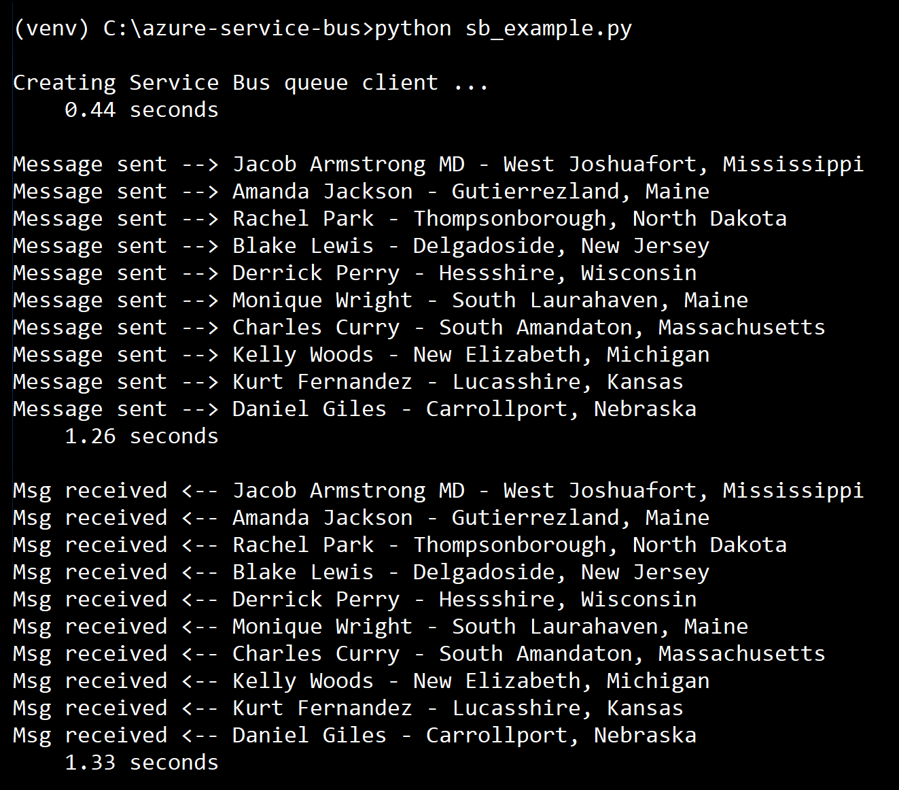

# azure-service-bus
Simple example of how to use an Azure Service Bus queue. Uses the Service Bus SDK for Python.

To install and configure the sample:

* clone this repo
* create a Service Bus name space using the Azure Portal, as covered [here](https://docs.microsoft.com/en-us/azure/service-bus-messaging/service-bus-create-namespace-portal)
* the Basic pricing tier is fine for this sample
* install Python 3.6 or higher
* create a ```settings.py``` file that sets the variable ```SB_CONN_STR``` to the Primary Connection String for your Service Bus namespace
* create a virtual environment and activate it, then install the requirements with ```python -m pip install -r requirements.txt```

The sample creates a queue named ```test_queue``` in your namespace, then generates 10 random names with the faker package, writes those messages to the queue, and reads the messages back from the queue. Here's an example of the output:



## Resources
* Python SDK documentation: [https://docs.microsoft.com/en-us/python/api/azure-servicebus/azure.servicebus?view=azure-python](https://docs.microsoft.com/en-us/python/api/azure-servicebus/azure.servicebus?view=azure-python)
* More information about using the SDK's queue client (including async usage): [https://docs.microsoft.com/en-us/python/api/overview/azure/servicebus?view=azure-python](https://docs.microsoft.com/en-us/python/api/overview/azure/servicebus?view=azure-python)
* Working with topics and subscriptions (not available in the Basic pricing tier): [https://docs.microsoft.com/en-us/azure/service-bus-messaging/service-bus-python-how-to-use-topics-subscriptions](https://docs.microsoft.com/en-us/azure/service-bus-messaging/service-bus-python-how-to-use-topics-subscriptions)
